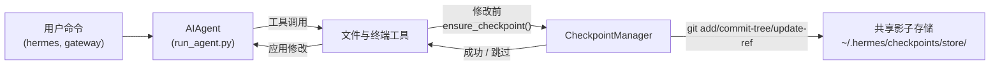

# 检查点与 `/rollback`

Hermes Agent 可以在**破坏性操作**之前自动为你的项目创建快照，并通过单个命令将其恢复。自 v2 起，检查点（Checkpoints）为**选择启用**——大多数用户从不使用 `/rollback`，且影子存储空间随时间增长显著，因此默认处于关闭状态。

通过 `--checkpoints` 在每个会话中启用检查点：

```bash
hermes chat --checkpoints
```

或在 `~/.hermes/config.yaml` 中全局启用：

```yaml
checkpoints:
  enabled: true
```

该安全网由内部**检查点管理器（Checkpoint Manager）**提供支持，它在 `~/.hermes/checkpoints/store/` 下维护一个单一的共享影子 Git 仓库——你的真实项目 `.git` 永远不会被触碰。Agent 处理的每个项目共享同一个存储，因此 Git 的内容可寻址对象数据库可以在项目之间以及轮次之间进行去重。

## 触发检查点的条件

检查点将在以下操作之前自动创建：

- **文件工具** —— `write_file` 和 `patch`
- **破坏性终端命令** —— `rm`、`rmdir`、`cp`、`install`、`mv`、`sed -i`、`truncate`、`dd`、`shred`、输出重定向（`>`）以及 `git reset`/`clean`/`checkout`

Agent 在同一轮次中**每个目录最多创建一个检查点**，因此长时间运行的会话不会产生大量快照。

## 快速参考

会话内斜杠命令：

| 命令 | 描述 |
|---------|-------------|
| `/rollback` | 列出所有检查点及变更统计 |
| `/rollback <N>` | 恢复到检查点 N（同时撤销上一聊天轮次） |
| `/rollback diff <N>` | 预览从检查点 N 到当前状态的差异 |
| `/rollback <N> <file>` | 从检查点 N 恢复单个文件 |

用于在会话外检查和管理存储的 CLI：

| 命令 | 描述 |
|---------|-------------|
| `hermes checkpoints` | 显示总大小、项目数、各项目细分 |
| `hermes checkpoints status` | 等同于裸 `checkpoints` |
| `hermes checkpoints list` | `status` 的别名 |
| `hermes checkpoints prune` | 强制清理：删除孤立/过期项、垃圾回收、强制执行大小上限 |
| `hermes checkpoints clear` | 清除整个检查点基础目录（需确认） |
| `hermes checkpoints clear-legacy` | 仅删除从 v1 迁移而来的 `legacy-*` 归档 |

## 检查点的工作原理

从高层次来看：

- Hermes 检测工具何时即将**修改**工作目录树中的文件。
- 每个对话轮次（每个目录）一次，它会：
  - 为文件解析合理的项目根目录。
  - 在 `~/.hermes/checkpoints/store/` 初始化或重用**单一共享影子存储**。
  - 暂存到项目索引，构建树，并提交到项目引用（`refs/hermes/<project-hash>`）。
- 这些项目引用形成了一条检查点历史记录，你可以通过 `/rollback` 查看和恢复。



## 配置

在 `~/.hermes/config.yaml` 中配置：

```yaml
checkpoints:
  enabled: false              # 主开关（默认：false — 选择启用）
  max_snapshots: 20           # 每个项目最大检查点数（通过引用重写+垃圾回收强制）
  max_total_size_mb: 500      # 存储总大小硬上限；丢弃最旧的提交
  max_file_size_mb: 10        # 跳过任何大于此值的单个文件

  # 自动维护（默认开启）：启动时清理 ~/.hermes/checkpoints/
  # 并删除工作目录不再存在的项目条目（孤立项）或最后触时间超过 retention_days 的项目条目。
  # 运行频率不超过 min_interval_hours，通过 .last_prune 标记跟踪。
  auto_prune: true
  retention_days: 7
  delete_orphans: true
  min_interval_hours: 24
```

要完全禁用：

```yaml
checkpoints:
  enabled: false
  auto_prune: false
```

当 `enabled: false` 时，检查点管理器不执行任何操作，从不尝试 Git 操作。当 `auto_prune: false` 时，存储会一直增长，直到你手动运行 `hermes checkpoints prune`。

## 列出检查点

在 CLI 会话中：

```
/rollback
```

Hermes 会返回一个格式化的列表，显示变更统计信息：

```text
📸 项目 /path/to/project 的检查点：

  1. 4270a8c  2026-03-16 04:36  在 patch 之前  (1 个文件, +1/-0)
  2. eaf4c1f  2026-03-16 04:35  在 write_file 之前
  3. b3f9d2e  2026-03-16 04:34  在终端命令之前: sed -i s/old/new/ config.py  (1 个文件, +1/-1)

  /rollback <N>             恢复到检查点 N
  /rollback diff <N>        预览从检查点 N 开始的变更
  /rollback <N> <file>      从检查点 N 恢复单个文件
```

## 从 Shell 检查存储

```bash
hermes checkpoints
```

示例输出：

```text
检查点基础目录: /home/you/.hermes/checkpoints
总大小:      142.3 MB
  store/         138.1 MB
  legacy-*       4.2 MB
项目数:        12

  WORKDIR                                                       COMMITS    LAST TOUCH  STATE
  /home/you/code/hermes-agent                                        20       2h ago  live
  /home/you/code/experiments/rl-runner                                8       1d ago  live
  /home/you/code/old-prototype                                        3       9d ago  orphan
  ...

旧版归档 (1):
  legacy-20260506-050616                           4.2 MB

清除命令: hermes checkpoints clear-legacy
```

强制全面清理（忽略 24 小时幂等标记）：

```bash
hermes checkpoints prune --retention-days 3 --max-size-mb 200
```

## 使用 `/rollback diff` 预览变更

在提交恢复之前，预览自某个检查点以来的变更：

```
/rollback diff 1
```

这将显示 Git diff 统计摘要，后跟实际差异。

## 使用 `/rollback` 进行恢复

```
/rollback 1
```

在幕后，Hermes：

1. 验证目标提交在影子存储中存在。
2. 对当前状态拍摄**预回滚快照**，以便稍后可以“撤销撤销”。
3. 恢复工作目录中的跟踪文件。
4. **撤销最后一个聊天轮次**，使 Agent 的上下文与恢复后的文件系统状态匹配。

## 单个文件恢复

仅从检查点恢复一个文件，而不影响目录中的其余文件：

```
/rollback 1 src/broken_file.py
```

## 安全与性能保护

- **Git 可用性** —— 如果在 `PATH` 中找不到 `git`，则检查点会被透明地禁用。
- **目录范围** —— Hermes 会跳过过于宽泛的目录（根目录 `/`，家目录 `$HOME`）。
- **仓库大小** —— 文件数超过 50,000 的目录会被跳过。
- **单文件大小上限** —— 大于 `max_file_size_mb`（默认 10 MB）的文件会被排除在快照之外。防止意外包含数据集、模型权重或生成的多媒体文件。
- **存储总大小上限** —— 当存储超过 `max_total_size_mb`（默认 500 MB）时，轮询丢弃每个项目最旧的提交，直到低于上限。
- **真正清理** —— `max_snapshots` 通过重写项目引用并随后运行 `git gc --prune=now` 来强制实现，从而避免松散对象积累。
- **无变更快照** —— 如果自上次快照以来没有变更，则跳过检查点。
- **非致命错误** —— 检查点管理器内部的所有错误都以调试级别记录；你的工具会继续运行。

## 检查点的存储位置

```text
~/.hermes/checkpoints/
  ├── store/                 # 单一共享裸 Git 仓库
  │   ├── HEAD, objects/     # Git 内部结构（跨项目共享）
  │   ├── refs/hermes/<hash> # 项目分支指针
  │   ├── indexes/<hash>     # 项目 Git 索引
  │   ├── projects/<hash>.json  # 工作目录 + 创建时间 + 最后触时间
  │   └── info/exclude
  ├── .last_prune            # 自动清理幂等标记
  └── legacy-<ts>/           # 归档的 v1 之前按项目划分的影子仓库
```

每个 `<hash>` 由工作目录的绝对路径派生而来。通常你不需要手动接触它们 —— 使用 `hermes checkpoints status` / `prune` / `clear` 代替。

### 从 v1 迁移

在 v2 重写之前，每个工作目录在 `~/.hermes/checkpoints/<hash>/` 下拥有自己完整的影子 Git 仓库。该布局无法在项目之间去重对象，并且清理器被记录为无操作——存储会无限增长。

第一次运行 v2 时，任何 v1 之前的影子仓库都会被移动到 `~/.hermes/checkpoints/legacy-<timestamp>/`，以便新的单一存储布局从头开始。旧的 `/rollback` 历史记录仍然可以通过使用 `git` 手动检查旧版归档来访问；一旦你确信不再需要它，运行：

```bash
hermes checkpoints clear-legacy
```

以回收空间。旧版归档也会在 `retention_days` 后被 `auto_prune` 清理。

## 最佳实践

- **仅在需要时启用检查点** —— `hermes chat --checkpoints` 或按配置文件设置 `enabled: true`。
- **在恢复之前使用 `/rollback diff`** —— 预览将要发生的变化，从而选择正确的检查点。
- **当你只想撤消 Agent 驱动的更改时，使用 `/rollback` 而非 `git reset`**。
- **如果经常使用检查点，偶尔检查 `hermes checkpoints status`** —— 显示哪些项目处于活动状态以及存储的成本。
- **结合 Git worktrees（工作树）以获得最大安全性** —— 将每个 Hermes 会话保持在其自己的工作树/分支中，并将检查点作为额外一层。

关于在同一仓库上并行运行多个 Agent 的信息，请参阅 [Git worktrees](./git-worktrees.md) 指南。