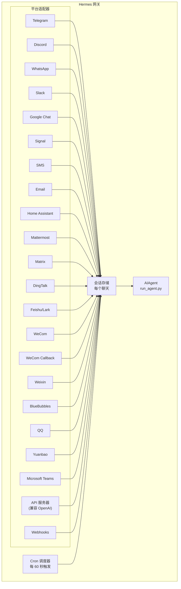

sidebar_position: 1
title: "消息网关（Messaging Gateway）"
description: "通过 Telegram、Discord、Slack、WhatsApp、Signal、短信、电子邮件、Home Assistant、Mattermost、Matrix、钉钉、元宝、Microsoft Teams、LINE、Raft、Webhooks 或任何兼容 OpenAI 的前端（通过 API 服务器）与 Hermes 聊天——架构与设置概述"
---

--- body ---
# 消息网关（Messaging Gateway）

通过 Telegram、Discord、Slack、WhatsApp、Signal、短信、电子邮件、Home Assistant、Mattermost、Matrix、钉钉、飞书/Lark、企业微信、微信、BlueBubbles（iMessage）、QQ、元宝、Microsoft Teams、LINE、ntfy 或您的浏览器与 Hermes 聊天。网关是一个后台进程，连接到所有已配置的平台，处理会话（session），运行定时任务（cron job），并传递语音消息。

有关完整的语音功能集——包括 CLI 麦克风模式、消息中的语音回复以及 Discord 语音频道对话——请参阅 [语音模式](/user-guide/features/voice-mode) 和 [与 Hermes 一起使用语音模式](/guides/use-voice-mode-with-hermes)。

:::tip
机器人需要同时拥有模型提供商（model provider）和工具提供商（tool provider）（TTS、网页）。[Nous Portal](/integrations/nous-portal) 订阅可捆绑所有服务。
:::

## 平台对比

| 平台 | 语音 | 图片 | 文件 | 线程 | 反应 | 输入中 | 流式输出 |
|----------|:-----:|:------:|:-----:|:-------:|:---------:|:------:|:---------:|
| Telegram | ✅ | ✅ | ✅ | ✅ | — | ✅ | ✅ |
| Discord | ✅ | ✅ | ✅ | ✅ | ✅ | ✅ | ✅ |
| Slack | ✅ | ✅ | ✅ | ✅ | ✅ | ✅ | ✅ |
| Google Chat | — | ✅ | ✅ | ✅ | — | ✅ | — |
| WhatsApp | — | ✅ | ✅ | — | — | ✅ | ✅ |
| Signal | — | ✅ | ✅ | — | — | ✅ | ✅ |
| 短信 | — | — | — | — | — | — | — |
| 电子邮件 | — | ✅ | ✅ | ✅ | — | — | — |
| Home Assistant | — | — | — | — | — | — | — |
| Mattermost | ✅ | ✅ | ✅ | ✅ | — | ✅ | ✅ |
| Matrix | ✅ | ✅ | ✅ | ✅ | ✅ | ✅ | ✅ |
| 钉钉 | — | ✅ | ✅ | — | ✅ | — | ✅ |
| 飞书/Lark | ✅ | ✅ | ✅ | ✅ | ✅ | ✅ | ✅ |
| 企业微信 | ✅ | ✅ | ✅ | — | — | — | — |
| 企业微信回调 | — | — | — | — | — | — | — |
| 微信 | ✅ | ✅ | ✅ | — | — | ✅ | ✅ |
| BlueBubbles | — | ✅ | ✅ | — | ✅ | ✅ | — |
| QQ | ✅ | ✅ | ✅ | — | — | ✅ | — |
| 元宝 | ✅ | ✅ | ✅ | — | — | ✅ | ✅ |
| Microsoft Teams | — | ✅ | — | ✅ | — | ✅ | — |
| LINE | — | ✅ | ✅ | — | — | ✅ | — |
| ntfy | — | — | — | — | — | — | — |
| Raft | — | — | — | — | — | — | — |

**语音** = TTS 音频回复和/或语音消息转录。**图片** = 发送/接收图片。**文件** = 发送/接收文件附件。**线程** = 线程化对话。**反应** = 消息上的表情反应。**输入中** = 处理时显示输入指示器。**流式输出** = 通过编辑实现渐进式消息更新。

## 架构



每个平台适配器接收消息，通过每个聊天的会话存储进行路由，并将消息分派给 AIAgent 进行处理。网关还运行 cron 调度器，每 60 秒触发一次，以执行任何到期的任务。

## 静默令牌（Intentional Silence Tokens）

对于群组聊天、钩子（hooks）和自动化流程，Hermes 支持显式的静默令牌。如果代理的最终回复恰好是一个支持的静默令牌，网关将抑制对外发送，不会向聊天发送任何内容。

支持的令牌：

- `[SILENT]`
- `SILENT`
- `NO_REPLY`
- `NO REPLY`

空白字符和大小写会被标准化，但整个最终回复必须是这个令牌。像 "Use `[SILENT]` when nothing changed" 这样的句子会正常发送。

静默仅仅是发送决策。Hermes 会在会话记录中保留助手的静默轮次，因此对话仍然正常交替：

```text
user: 侧信道闲聊
assistant: [SILENT]   # 已存储，但未发送
user: 下一条消息
```

失败的轮次仍会作为错误显示；Hermes 不会仅仅因为文本类似于静默令牌而隐藏故障。

## 快速设置

配置消息平台最简单的方式是使用交互式向导：

```bash
hermes gateway setup        # 所有消息平台的交互式设置
```

此命令将引导您通过方向键选择来配置每个平台，显示哪些平台已配置，并在完成后提供启动/重启网关的选项。

## 网关命令

```bash
hermes gateway              # 前台运行
hermes gateway setup        # 交互式配置消息平台
hermes gateway install      # 作为用户服务安装（Linux）/ launchd 服务（macOS）
sudo hermes gateway install --system   # 仅 Linux：安装为启动时系统服务
hermes gateway start        # 启动默认服务
hermes gateway stop         # 停止默认服务
hermes gateway status       # 检查默认服务状态
hermes gateway status --system         # 仅 Linux：显式检查系统服务
```

## 聊天内命令（在消息内）

| 命令 | 描述 |
|---------|-------------|
| `/new` 或 `/reset` | 开始新的对话 |
| `/model [provider:model]` | 显示或更改模型（支持 `provider:model` 语法） |
| `/personality [name]` | 设置人格（personality） |
| `/retry` | 重试上一条消息 |
| `/undo` | 移除上一次交互 |
| `/status` | 显示会话信息 |
| `/whoami` | 显示您在此作用域（scope）上的斜杠命令访问权限（管理员/用户/无限制） |
| `/stop` | 停止正在运行的代理 |
| `/approve` | 批准待处理的危险命令 |
| `/deny` | 拒绝待处理的危险命令 |
| `/sethome` | 将此聊天设为主频道 |
| `/compress` | 手动压缩对话上下文 |
| `/title [name]` | 设置或显示会话标题 |
| `/resume [name]` | 恢复之前命名的会话 |
| `/usage` | 显示此会话的令牌使用量 |
| `/insights [days]` | 显示使用情况洞察和分析 |
| `/reasoning [level\|show\|hide]` | 更改推理努力程度或切换推理显示 |
| `/voice [on\|off\|tts\|join\|leave\|status]` | 控制消息语音回复和 Discord 语音频道行为 |
| `/rollback [number]` | 列出或还原文件系统检查点 |
| `/background <prompt>` | 在单独的背景会话中运行提示 |
| `/reload-mcp` | 从配置重新加载 MCP 服务器 |
| `/update` | 将 Hermes Agent 更新到最新版本 |
| `/help` | 显示可用命令 |
| `/<skill-name>` | 调用任何已安装的技能（skill） |

## 会话管理

### 会话持久化

会话在消息之间持续存在，直到重置。代理会记住您的对话上下文。

### 重置策略

会话根据可配置的策略重置：

| 策略 | 默认值 | 描述 |
|--------|---------|-------------|
| 每日 | 4:00 AM | 每天在特定小时重置 |
| 空闲 | 1440 分钟 | 在 N 分钟无活动后重置 |
| 两者 | (组合) | 以先触发的为准 |

在 `~/.hermes/gateway.json` 中配置按平台的覆盖：

```json
{
  "reset_by_platform": {
    "telegram": { "mode": "idle", "idle_minutes": 240 },
    "discord": { "mode": "idle", "idle_minutes": 60 }
  }
}
```

## 安全

**默认情况下，网关拒绝所有不在允许列表（allowlist）中或未通过 DM 配对的用户。** 这是对于拥有终端访问权限的机器人的安全默认设置。

```bash
# 限制为特定用户（推荐）：
TELEGRAM_ALLOWED_USERS=123456789,987654321
DISCORD_ALLOWED_USERS=123456789012345678
SIGNAL_ALLOWED_USERS=+155****4567,+155****6543
SMS_ALLOWED_USERS=+155****4567,+155****6543
EMAIL_ALLOWED_USERS=trusted@example.com,colleague@work.com
MATTERMOST_ALLOWED_USERS=3uo8dkh1p7g1mfk49ear5fzs5c
MATRIX_ALLOWED_USERS=@alice:matrix.org
DINGTALK_ALLOWED_USERS=user-id-1
FEISHU_ALLOWED_USERS=ou_xxxxxxxx,ou_yyyyyyyy
WECOM_ALLOWED_USERS=user-id-1,user-id-2
WECOM_CALLBACK_ALLOWED_USERS=user-id-1,user-id-2
TEAMS_ALLOWED_USERS=aad-object-id-1,aad-object-id-2

# 或者允许
GATEWAY_ALLOWED_USERS=123456789,987654321

# 或者显式允许所有用户（对于具有终端访问权限的机器人，不推荐）：
GATEWAY_ALLOW_ALL_USERS=true
```

### DM 配对（允许列表的替代方案）

与其手动配置用户 ID，未知用户在与机器人进行 DM 时会收到一个一次性配对码。电子邮件是例外：除非显式启用电子邮件配对，否则未知的电子邮件发送者将被忽略。

```bash
# 用户看到："配对码：XKGH5N7P"
# 您通过以下方式批准他们：
hermes pairing approve telegram XKGH5N7P

# 其他配对命令：
hermes pairing list          # 查看待处理 + 已批准的用户
hermes pairing revoke telegram 123456789  # 移除访问权限
```

配对码在一小时后过期，有速率限制，并使用加密随机性。

### 管理员与普通用户

允许列表回答“这个人是否能访问机器人？”。**管理员/用户分离** 回答的是“既然他们进来了，他们被允许做什么？”。

每个允许的用户在每个作用域（DM 与群组/频道）中属于两个层级之一：

- **管理员** — 完全访问权限。可以运行每个已注册的斜杠命令（内置 + 插件）并使用所有受门控的能力。
- **普通用户** — 受限访问权限。可以正常与代理聊天，但只能运行您显式启用的斜杠命令。始终允许的基础命令是 `/help` 和 `/whoami`。

层级按平台和作用域配置。DM 管理员身份并不意味着群组/频道管理员身份——每个作用域都有自己的管理员列表。

**当前层级控制的内容：** 斜杠命令。拆分通过实时命令注册表运行，因此它覆盖了内置命令和插件注册的命令，无需逐个功能进行接线。纯聊天不受影响——非管理员仍然可以与代理对话。

**未来可能被控制的内容：** 更多的能力表面（工具访问、模型切换、昂贵操作）将使用相同的管理员/用户区分。现在配置好拆分，意味着将来这些限制会干净地应用，而无需重新建模谁是谁的管理员。

#### 配置

```yaml
gateway:
  platforms:
    discord:
      extra:
        allow_from: ["111", "222", "333"]
        allow_admin_from: ["111"]                    # 管理员 → 所有斜杠命令
        user_allowed_commands: [status, model]       # 非管理员可以运行的命令
        # 可选：单独的群组/频道作用域
        group_allow_admin_from: ["111"]
        group_user_allowed_commands: [status]
```

**向后兼容：** 如果某个作用域未设置 `allow_admin_from`，则该作用域的层级拆分被禁用，每个允许的用户都有完全访问权限。现有安装无需更改即可继续工作——当您需要区分时再选择启用。

#### 检查您的访问权限

在任何平台上使用 `/whoami` 来查看活动作用域、您的层级（管理员/用户/无限制）以及您可以运行哪些斜杠命令。请参阅 [Telegram](/user-guide/messaging/telegram#slash-command-access-control) 和 [Discord](/user-guide/messaging/discord#slash-command-access-control) 页面了解平台特定示例。

## 中断代理

在代理工作时发送任何消息即可中断它。关键行为：

- **正在进行的终端命令会立即被终止**（先 SIGTERM，1 秒后 SIGKILL）
- **工具调用被取消**——只有当前正在执行的工具会运行，其余的被跳过
- **多条消息会合并**——在中断期间发送的消息会合并成一个提示
- **`/stop` 命令**——中断而不排队后续消息

### 队列 vs 中断 vs 引导（忙输入模式）

默认情况下，给忙碌的代理发消息会中断它。还有另外两种模式可用：

- `queue` — 后续消息会等待，并在当前任务完成后作为下一轮运行。
- `steer` — 后续消息通过 `/steer` 注入到当前运行中，在下一个工具调用之后到达代理。不会中断，也不会产生新的轮次。如果代理尚未开始，则回退到 `queue` 行为。

```yaml
display:
  busy_input_mode: steer   # 或 queue，或 interrupt（默认）
  busy_ack_enabled: true   # 设置为 false 可完全抑制 ⚡/⏳/⏩ 聊天回复
```

当您在任何平台上首次给忙碌的代理发消息时，Hermes 会在忙确认（busy-ack）消息后追加一行提示，解释这个设置项（"💡 首次使用提示——…"）。该提示每安装一次只显示一次——由 `onboarding.seen.busy_input_prompt` 标志控制。删除该键可再次看到提示。

如果您觉得忙确认过于嘈杂——尤其是在语音输入或快速连续发消息时——请设置 `display.busy_ack_enabled: false`。您的输入仍然会正常排队/引导/中断，只是聊天回复被静音。

## 工具进度通知

控制 `~/.hermes/config.yaml` 中显示的工具活动量：

```yaml
display:
  tool_progress: all    # off | new | all | verbose
  tool_progress_command: false  # 设置为 true 可在消息中启用 /verbose
  # 在支持消息编辑的平台上，进度如何分组：
  #   accumulate（默认）— 随着工具运行，在同一个气泡内编辑更新
  #   separate             — 每个工具发送一条消息（v0.9 之前的方式；更嘈杂）
  # 仅在 tool_progress 已启用时生效。
  tool_progress_grouping: accumulate   # accumulate | separate
```

### 模型上下文中的消息时间戳

默认关闭。启用后，Hermes 将人类可读的时间戳（例如 `[Tue 2026-04-28 13:40:53 CEST]`）添加到每个**用户**消息前*在模型上下文中*，以便代理知道消息发送的时间——对于时间推理（“你今早问过……”，注意到长时间间隔）很有用。它*不*会添加到助手消息或系统提示中。

```yaml
gateway:
  message_timestamps:
    enabled: false   # 设置为 true 可向模型显示发送时间
```

持久化的记录始终保持干净——无论此开关如何，时间戳都会作为消息元数据存储，因此稍后启用它也会为过去的消息显示发送时间，并且重放不会积累重复的前缀。

启用后，机器人会在工作时发送状态消息：

```text
💻 `ls -la`...
🔍 web_search...
📄 web_extract...
🐍 execute_code...
```

## 后台会话（Background Sessions）

在单独的后台会话中运行一个提示，使代理独立工作，同时您的主聊天保持响应：

```
/background 检查集群中的所有服务器，并报告任何宕机的服务器
```

Hermes 立即确认：

```
🔄 后台任务已启动："检查集群中的所有服务器..."
   任务 ID：bg_143022_a1b2c3
```

### 工作原理

每个 `/background` 提示会生成一个**独立的代理实例**，异步运行：

- **隔离的会话** — 后台代理有自己的会话和对话历史。它不知道您当前的聊天上下文，只接收您提供的提示。
- **相同的配置** — 继承当前网关设置中的模型、提供商、工具集、推理设置和提供商路由。
- **非阻塞** — 您的主聊天保持完全交互式。在工作时可以发送消息、运行其他命令或启动更多后台任务。
- **结果交付** — 任务完成后，结果会发送回您发出命令的**同一聊天或频道**，前缀为 "✅ 后台任务完成"。如果失败，您将看到 "❌ 后台任务失败" 及错误信息。

### 后台进程通知

当运行后台会话的代理使用 `terminal(background=true)` 启动长时间运行的进程（服务器、构建等）时，网关可以向您的聊天推送状态更新。通过 `~/.hermes/config.yaml` 中的 `display.background_process_notifications` 控制：

```yaml
display:
  background_process_notifications: all    # all | result | error | off
```

| 模式 | 您会收到什么 |
|------|-----------------|
| `all` | 运行中的输出更新**和**最终完成消息（默认） |
| `result` | 仅最终完成消息（无论退出码如何） |
| `error` | 仅当退出码非零时的最终消息 |
| `off` | 无进程监视器消息 |

您也可以使用环境变量设置：

```bash
HERMES_BACKGROUND_NOTIFICATIONS=result
```

### 使用场景

- **服务器监控** — "/background 检查所有服务的健康状况，如果有任何宕机请提醒我"
- **长时间构建** — "/background 构建并部署 staging 环境"，同时您继续聊天
- **研究任务** — "/background 研究竞争对手的定价并用表格总结"
- **文件操作** — "/background 将 ~/Downloads 中的照片按日期整理到文件夹中"

:::tip
消息平台上的后台任务是“发后即忘”的——您无需等待或检查它们。任务完成时，结果会自动出现在同一聊天中。
:::

## 服务管理

### Linux（systemd）

```bash
hermes gateway install               # 安装为用户服务
hermes gateway start                 # 启动服务
hermes gateway stop                  # 停止服务
hermes gateway status                # 检查状态
journalctl --user -u hermes-gateway -f  # 查看日志

# 启用驻留（保持运行，即使注销后）
sudo loginctl enable-linger $USER

# 或者安装一个启动时系统服务，但以您的用户身份运行
sudo hermes gateway install --system
sudo hermes gateway start --system
sudo hermes gateway status --system
journalctl -u hermes-gateway -f
```

在笔记本电脑和开发机上使用用户服务。在 VPS 或无头主机上使用系统服务，这些主机应在启动时恢复运行，而不依赖 systemd 驻留。

:::tip 无头虚拟机：用户服务 + 驻留避免 root 提示
系统服务每次重启都需要 root 权限——包括 `hermes update` 结束时的自动网关重启。当 `hermes update` 以非 root 用户身份运行时，它会尝试无密码 `sudo systemctl`；如果不可用，它会跳过重启并打印手动 `sudo systemctl restart hermes-gateway` 命令（它不会在交互式密码提示上阻塞）。

对于您从未登录的无头虚拟机，启用驻留的**用户**服务可以带来相同的启动时启动行为，且无需任何 root 参与：

```bash
hermes gateway install          # 用户服务
sudo loginctl enable-linger $USER   # 一次性：启动时启动，注销后保持运行
```

之后，`hermes update` 可以在没有任何特权的情况下重启网关。如果您更喜欢保留系统服务，可以以 `sudo hermes update` 运行更新，或者授予服务帐户无密码 sudo 权限以执行 systemctl，例如在 `sudo visudo -f /etc/sudoers.d/hermes-gateway` 中：

```
hermes ALL=(root) NOPASSWD: /usr/bin/systemctl --no-ask-password reset-failed hermes-gateway*, /usr/bin/systemctl --no-ask-password start hermes-gateway*, /usr/bin/systemctl --no-ask-password restart hermes-gateway*
```
:::

除非确实需要，否则避免同时安装用户和系统网关单元。如果 Hermes 检测到两者都存在，它会发出警告，因为启动/停止/状态行为会变得模糊。

:::info 多个安装
如果您在同一台机器上运行多个 Hermes 安装（使用不同的 `HERMES_HOME` 目录），每个安装都有自己的 systemd 服务名称。默认的 `~/.hermes` 使用 `hermes-gateway`；其他安装使用 `hermes-gateway-<哈希>`。`hermes gateway` 命令会自动针对您当前 `HERMES_HOME` 的正确服务。
:::

### macOS（launchd）

```bash
hermes gateway install               # 安装为 launchd 代理
hermes gateway start                 # 启动服务
hermes gateway stop                  # 停止服务
hermes gateway status                # 检查状态
tail -f ~/.hermes/logs/gateway.log   # 查看日志
```

生成的 plist 文件位于 `~/Library/LaunchAgents/ai.hermes.gateway.plist`。它包含三个环境变量：

- **PATH** — 安装时的完整 shell PATH，并在前面添加了 venv `bin/` 和 `node_modules/.bin`。这确保用户安装的工具（Node.js、ffmpeg 等）可供网关子进程（如 WhatsApp 桥接）使用。
- **VIRTUAL_ENV** — 指向 Python 虚拟环境，以便工具可以正确解析包。
- **HERMES_HOME** — 将网关限定到您的 Hermes 安装。

:::tip 安装后 PATH 更改
launchd plist 是静态的——如果您在设置网关后安装了新工具（例如通过 nvm 安装新的 Node.js 版本，或通过 Homebrew 安装 ffmpeg），请再次运行 `hermes gateway install` 以捕获更新后的 PATH。网关将检测到过时的 plist 并自动重新加载。
:::

:::info 多个安装
与 Linux systemd 服务类似，每个 `HERMES_HOME` 目录都有一个自己的 launchd 标签。默认的 `~/.hermes` 使用 `ai.hermes.gateway`；其他安装使用 `ai.hermes.gateway-<后缀>`。
:::

## 平台特定工具集

每个平台都有自己的工具集：

| 平台 | 工具集 | 能力 |
|----------|---------|--------------|
| CLI | `hermes-cli` | 完全访问 |
| Telegram | `hermes-telegram` | 完整工具，包括终端 |
| Discord | `hermes-discord` | 完整工具，包括终端 |
| WhatsApp | `hermes-whatsapp` | 完整工具，包括终端 |
| WhatsApp Cloud API | `hermes-whatsapp` | 完整工具，包括终端（与 Baileys 桥接共享工具集） |
| Slack | `hermes-slack` | 完整工具，包括终端 |
| Google Chat | `hermes-google_chat` | 完整工具，包括终端 |
| Signal | `hermes-signal` | 完整工具，包括终端 |
| 短信 | `hermes-sms` | 完整工具，包括终端 |
| 电子邮件 | `hermes-email` | 完整工具，包括终端 |
| Home Assistant | `hermes-homeassistant` | 完整工具 + HA 设备控制（ha_list_entities, ha_get_state, ha_call_service, ha_list_services） |
| Mattermost | `hermes-mattermost` | 完整工具，包括终端 |
| Matrix | `hermes-matrix` | 完整工具，包括终端 |
| 钉钉 | `hermes-dingtalk` | 完整工具，包括终端 |
| 飞书/Lark | `hermes-feishu` | 完整工具，包括终端 |
| 企业微信 | `hermes-wecom` | 完整工具，包括终端 |
| 企业微信回调 | `hermes-wecom-callback` | 完整工具，包括终端 |
| 微信 | `hermes-weixin` | 完整工具，包括终端 |
| BlueBubbles | `hermes-bluebubbles` | 完整工具，包括终端 |
| QQBot | `hermes-qqbot` | 完整工具，包括终端 |
| 元宝 | `hermes-yuanbao` | 完整工具，包括终端 |
| Microsoft Teams | `hermes-teams` | 完整工具，包括终端 |
| API 服务器 | `hermes-api-server` | 完整工具（移除了 `clarify`、`send_message`、`text_to_speech`——编程访问没有交互式用户） |
| Webhooks | `hermes-webhook` | 完整工具，包括终端 |
| Raft | `hermes-raft` | 仅唤醒通道；代理使用 Raft CLI 进行消息 I/O |

## 运营多平台网关

一个网关通常同时运行多个适配器（Telegram + Discord + Slack 等）。以下部分涵盖了跨所有平台的第二天运营。

### `/platform` 命令

网关运行后，使用任何连接的 CLI 会话或聊天中的 `/platform` 斜杠命令来检查和操控单个适配器，而无需重启整个网关：

```
/platform list                  # 显示所有适配器及其状态
/platform pause <name>          # 停止向一个适配器分派新消息
/platform resume <name>         # 重新启用暂停的适配器
```

`/platform list` 显示每个适配器是 `running`、`paused`（手动）还是 `paused-by-breaker`（参见下文）。暂停会保持适配器加载并保持其后台循环存活——传入消息会被丢弃，但连接本身保持打开，因此恢复是即时的。

另请参阅更广泛的摘要状态命令 [`/platforms`](../../reference/slash-commands.md#info)。

### 自动断路器（Circuit Breaker）

每个适配器都被包裹在一个断路器中。重复的可重试故障（网络波动、速率限制回复、5xx 上游响应、WebSocket 断开）会导致断路器跳闸——适配器被自动暂停，当配置了主频道时，会向另一个活跃平台的主频道发送操作员通知，并输出结构化的日志行。

断路器**不会**自动恢复——它保持打开状态，直到您手动运行 `/platform resume <name>`。这是有意为之：如果某个平台持续中断，您不希望网关反复重连。

### 平台暂停时如何排查

当适配器暂停时，请检查：

1. **网关日志**（`~/.hermes/logs/gateway.log` 或 systemd/launchd 单元日志）。搜索平台名称以及 `circuit breaker`、`paused` 或 `disabled`。跳闸事件包括故障计数和最后一个错误。
2. **`/platform list`** 输出——显示当前状态和最后原因。
3. **提供商的 status 页面**（Telegram 机器人 API 状态、Discord 状态等）。断路器跳闸是因为平台不健康；在它恢复之前不要尝试恢复。

一旦上游恢复健康，`/platform resume <name>` 会清除断路器并重新启用适配器。

### 重启通知

当网关重启（或关闭时存在正在进行的会话）时，它可以向每个平台的主频道发送一条一次性的“代理已恢复”/“代理被中断”消息。这由 `gateway-config.yaml` 中每个平台的 `gateway_restart_notification` 标志控制，默认为 `true`：

```yaml
gateway:
  platforms:
    telegram:
      home_chat_id: "123456789"
      gateway_restart_notification: false   # 对此平台选择退出
    discord:
      home_chat_id: "987654321"
      # gateway_restart_notification 省略 → 默认为 true
```

在嘈杂或低优先级的平台上禁用它，同时在您的主要聊天中保持开启。无论有多少个正在进行的会话，每次重启只会发送一次通知。

### 跨网关重启的会话恢复

当网关在正在进行的工具调用或生成过程中关闭时，受影响的会话会被标记为 `restart_interrupted`。下次启动时，网关会为每个会话安排自动恢复——用户会在聊天中收到简短提示（“重启后发送任意消息，我会尝试在您离开的地方恢复。”），当他们回复后，会话会从最后一个已提交的轮次继续。

此行为默认开启，并在网关启动时记录：

```
已为 N 个重启中断的会话安排了自动恢复
```

无需配置。如果您不希望看到提示，请在平台上设置 `gateway_restart_notification: false`。

### 移动端友好的进度默认值

Telegram 通常是移动端收件箱，因此默认值针对该表面进行了调整：

- **`tool_progress`** 默认**关闭**——不会在聊天中填充每个工具的操作流。
- **`busy_ack_detail`** 默认**关闭**——忙碌状态确认和长时间运行的心跳保持简洁（没有 "iteration 21/60" 调试细节）。
- **`interim_assistant_messages`** 保持**开启**——实时的回合中助手评论（模型明确告诉您它将要做什么）是信号而非噪音。
- **`long_running_notifications`** 保持**开启**——一个原地编辑的 "⏳ 工作中 — N 分钟" 气泡每隔几分钟更新一次，这样您可以看到心跳，而不是盯着 `输入中...` 半小时。

可以选择退出这两个保持开启的默认值，或者按平台重新启用详细的进度信息：

```yaml
display:
  platforms:
    telegram:
      # 重新启用工具进度流
      tool_progress: new
      # 在心跳和忙碌确认中显示 "iteration N/M, running: tool"
      busy_ack_detail: true
      # 或者完全静默它们
      interim_assistant_messages: false
      long_running_notifications: false
```

### 进度气泡清理（可选加入）

工具进度消息、"仍在工作..."心跳和状态回调气泡也可以在最终回复送达后自动删除。通过 `display.platforms.<platform>.cleanup_progress` 按平台启用：

```yaml
display:
  platforms:
    telegram:
      cleanup_progress: true
    discord:
      cleanup_progress: true
```

默认为 `false`。只有适配器实现了 `delete_message` 的平台（当前为 Telegram 和 Discord）才会遵守此设置。失败的运行**跳过**清理，因此气泡作为调试线索保留。

## 下一步

- [Telegram 设置](telegram.md)
- [Discord 设置](discord.md)
- [Slack 设置](slack.md)
- [Google Chat 设置](google_chat.md)
- [WhatsApp 设置](whatsapp.md)
- [WhatsApp Business Cloud API 设置](whatsapp-cloud.md)
- [Signal 设置](signal.md)
- [短信设置（Twilio）](sms.md)
- [电子邮件设置](email.md)
- [Home Assistant 集成](homeassistant.md)
- [Mattermost 设置](mattermost.md)
- [Matrix 设置](matrix.md)
- [钉钉设置](dingtalk.md)
- [飞书/Lark 设置](feishu.md)
- [企业微信设置](wecom.md)
- [企业微信回调设置](wecom-callback.md)
- [微信设置](weixin.md)
- [BlueBubbles 设置（iMessage）](bluebubbles.md)
- [QQBot 设置](qqbot.md)
- [元宝设置](yuanbao.md)
- [Microsoft Teams 设置](teams.md)
- [Teams 会议管道](teams-meetings.md)
- [Open WebUI + API 服务器](open-webui.md)
- [Raft 设置](raft.md)
- [Webhooks](webhooks.md)