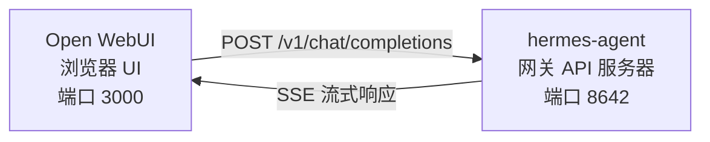

# Open WebUI 集成

[Open WebUI](https://github.com/open-webui/open-webui)（126k★）是最流行的自托管 AI 聊天界面。借助 Hermes Agent 内置的 API 服务器，你可以将 Open WebUI 用作智能体（Agent）的精致 Web 前端——包含对话管理、用户账户和现代化的聊天界面。

## 架构



Open WebUI 连接到 Hermes Agent 的 API 服务器，就像连接到 OpenAI 一样。Hermes 使用其完整工具集（终端、文件操作、网络搜索、记忆、技能（Skill））处理请求，并返回最终响应。

:::important 运行时位置
API 服务器是一个 **Hermes Agent 运行时**，而不是纯 LLM 代理。对于每个请求，Hermes 会在 API 服务器主机上创建一个服务端 `AIAgent`。工具调用在该 API 服务器运行的位置执行。

例如，如果一台笔记本电脑将 Open WebUI 或其他兼容 OpenAI 的客户端指向远程机器上的 Hermes API 服务器，那么 `pwd`、文件工具、浏览器工具、本地 MCP 工具和其他工作区工具将在远程 API 服务器主机上运行，而不是在笔记本电脑上。
:::

Open WebUI 与 Hermes 是服务器到服务器通信，因此此集成不需要设置 `API_SERVER_CORS_ORIGINS`。

## 快速设置

### 一键本地启动（macOS/Linux，无 Docker）

如果你想在本地将 Hermes + Open WebUI 配置在一起，并获得一个可复用的启动器，请运行：

```bash
cd ~/.hermes/hermes-agent
bash scripts/setup_open_webui.sh
```

该脚本执行以下操作：

- 确保 `~/.hermes/.env` 包含 `API_SERVER_ENABLED`、`API_SERVER_HOST`、`API_SERVER_KEY`、`API_SERVER_PORT` 和 `API_SERVER_MODEL_NAME`
- 重启 Hermes 网关以启动 API 服务器
- 将 Open WebUI 安装到 `~/.local/open-webui-venv`
- 在 `~/.local/bin/start-open-webui-hermes.sh` 写入启动器
- 在 macOS 上，安装一个 `launchd` 用户服务；在支持 `systemd --user` 的 Linux 上，安装一个用户服务

默认值：

- Hermes API：`http://127.0.0.1:8642/v1`
- Open WebUI：`http://127.0.0.1:8080`
- 向 Open WebUI 通告的模型名称：`Hermes Agent`

有用的覆盖项：

```bash
OPEN_WEBUI_NAME='My Hermes UI' \
OPEN_WEBUI_ENABLE_SIGNUP=true \
HERMES_API_MODEL_NAME='My Hermes Agent' \
bash scripts/setup_open_webui.sh
```

在 Linux 上，自动后台服务设置需要一个可用的 `systemd --user` 会话。如果你在无头 SSH 机器上，并且想跳过服务安装，请运行：

```bash
OPEN_WEBUI_ENABLE_SERVICE=false bash scripts/setup_open_webui.sh
```

### 1. 启用 API 服务器

```bash
hermes config set API_SERVER_ENABLED true
hermes config set API_SERVER_KEY your-secret-key
```

`hermes config set` 会自动将标志写入 `config.yaml`，将密钥写入 `~/.hermes/.env`。如果网关已在运行，请重启以使更改生效：

```bash
hermes gateway stop && hermes gateway
```

### 2. 启动 Hermes Agent 网关

```bash
hermes gateway
```

你应该看到：

```
[API Server] API server listening on http://127.0.0.1:8642
```

### 3. 验证 API 服务器可访问

```bash
curl -s http://127.0.0.1:8642/health
# {"status": "ok", ...}

curl -s -H "Authorization: Bearer your-secret-key" http://127.0.0.1:8642/v1/models
# {"object":"list","data":[{"id":"hermes-agent", ...}]}
```

如果 `/health` 失败，说明网关未启用 `API_SERVER_ENABLED=true`——请重启。如果 `/v1/models` 返回 `401`，说明你的 `Authorization` 头与 `API_SERVER_KEY` 不匹配。

### 4. 启动 Open WebUI

```bash
docker run -d -p 3000:8080 \
  -e OPENAI_API_BASE_URL=http://host.docker.internal:8642/v1 \
  -e OPENAI_API_KEY=your-secret-key \
  -e ENABLE_OLLAMA_API=false \
  --add-host=host.docker.internal:host-gateway \
  -v open-webui:/app/backend/data \
  --name open-webui \
  --restart always \
  ghcr.io/open-webui/open-webui:main
```

`ENABLE_OLLAMA_API=false` 会禁用默认的 Ollama 后端，否则该后端会显示为空并干扰模型选择器。如果你实际运行了 Ollama，可以省略此选项。

首次启动需要 15–30 秒：Open WebUI 会在第一次启动时下载 sentence-transformer 嵌入模型（约 150MB）。请在打开 UI 前等待 `docker logs open-webui` 的输出稳定。

### 5. 打开 UI

访问 **http://localhost:3000**。创建你的管理员账户（第一个用户将成为管理员）。你应该能在模型下拉列表中看到你的智能体（以你的配置文件命名，或者默认配置文件显示为 **hermes-agent**）。开始聊天吧！

## Docker Compose 设置

对于更持久的设置，创建一个 `docker-compose.yml`：

```yaml
services:
  open-webui:
    image: ghcr.io/open-webui/open-webui:main
    ports:
      - "3000:8080"
    volumes:
      - open-webui:/app/backend/data
    environment:
      - OPENAI_API_BASE_URL=http://host.docker.internal:8642/v1
      - OPENAI_API_KEY=your-secret-key
      - ENABLE_OLLAMA_API=false
    extra_hosts:
      - "host.docker.internal:host-gateway"
    restart: always

volumes:
  open-webui:
```

然后：

```bash
docker compose up -d
```

## 通过管理 UI 进行配置

如果你更愿意通过 UI 而非环境变量来配置连接：

1. 登录 Open WebUI，访问 **http://localhost:3000**
2. 点击你的 **个人资料头像** → **管理员设置**
3. 进入 **连接**
4. 在 **OpenAI API** 下，点击 **扳手图标**（管理）
5. 点击 **+ 添加新连接**
6. 输入：
   - **URL**：`http://host.docker.internal:8642/v1`
   - **API 密钥**：与 Hermes 中的 `API_SERVER_KEY` 完全相同
7. 点击 **对勾** 验证连接
8. **保存**

现在，你的智能体模型应该会出现在模型下拉列表中（以你的配置文件命名，或者默认配置文件显示为 **hermes-agent**）。

:::warning
环境变量仅在 Open WebUI 的**首次启动**时生效。之后，连接设置会存储在其内部数据库中。日后如需更改，请使用管理 UI，或删除 Docker 卷并重新开始。
:::

## API 类型：Chat Completions 与 Responses

Open WebUI 在连接后端时支持两种 API 模式：

| 模式 | 格式 | 何时使用 |
|------|------|----------|
| **Chat Completions**（默认） | `/v1/chat/completions` | 推荐。开箱即用。 |
| **Responses**（实验性） | `/v1/responses` | 通过 `previous_response_id` 实现服务端对话状态。 |

### 使用 Chat Completions（推荐）

这是默认模式，无需额外配置。Open WebUI 发送标准 OpenAI 格式的请求，Hermes Agent 相应响应。每个请求包含完整的对话历史。

### 使用 Responses API

要使用 Responses API 模式：

1. 进入 **管理员设置** → **连接** → **OpenAI** → **管理**
2. 编辑你的 hermes-agent 连接
3. 将 **API 类型** 从 "Chat Completions" 改为 **"Responses（实验性）"**
4. 保存

使用 Responses API 时，Open WebUI 以 Responses 格式（`input` 数组 + `instructions`）发送请求，Hermes Agent 可以通过 `previous_response_id` 在多次轮次中保留完整的工具调用历史。当 `stream: true` 时，Hermes 还会流式传输规范原生的事件项 `function_call` 和 `function_call_output`，从而允许在渲染 Responses 事件的客户端中实现自定义结构化的工具调用 UI。

:::note
目前，即使在 Responses 模式下，Open WebUI 也在客户端管理对话历史——它会在每个请求中发送完整消息历史，而不是使用 `previous_response_id`。当前 Responses 模式的主要优势在于结构化事件流：文本增量、`function_call` 和 `function_call_output` 项作为 OpenAI Responses SSE 事件到达，而不是作为 Chat Completions 分块。
:::

## 工作原理

当你在 Open WebUI 中发送消息时：

1. Open WebUI 发送一个 `POST /v1/chat/completions` 请求，包含你的消息和对话历史
2. Hermes Agent 使用 API 服务器的配置文件、模型/提供商配置、记忆、技能和已配置的 API 服务器工具集，创建一个服务端 `AIAgent` 实例
3. 智能体处理你的请求——它可能会在 API 服务器主机上调用工具（终端、文件操作、网络搜索等）
4. 工具执行时，**内联进度消息会流式传输到 UI**，让你看到智能体正在做什么（例如 `` `💻 ls -la` ``, `` `🔍 Python 3.12 release` ``）
5. 智能体的最终文本响应流式传输回 Open WebUI
6. Open WebUI 在其聊天界面中显示响应

你的智能体拥有与该 API 服务器的 Hermes 实例相同的工具和能力。如果 API 服务器是远程的，那么这些工具也是远程的。

如果你需要工具针对你的**本地**工作区运行，目前请在本地运行 Hermes，并将其指向一个纯 LLM 提供商或纯兼容 OpenAI 的模型代理（例如 vLLM、LiteLLM、Ollama、llama.cpp、OpenAI、OpenRouter 等）。未来将有一种“远程大脑，本地双手”的分裂运行时模式，在 [#18715](https://github.com/NousResearch/hermes-agent/issues/18715) 中跟踪；当前 API 服务器并未实现此行为。

:::tip 工具进度
启用流式传输（默认）后，你会在工具运行时看到简短的内联指示器——工具表情符号及其关键参数。这些指示器会出现在最终答案之前的响应流中，让你了解幕后发生了什么。
:::

## 配置参考

### Hermes Agent（API 服务器）

| 变量 | 默认值 | 描述 |
|----------|---------|------|
| `API_SERVER_ENABLED` | `false` | 启用 API 服务器 |
| `API_SERVER_PORT` | `8642` | HTTP 服务器端口 |
| `API_SERVER_HOST` | `127.0.0.1` | 绑定地址 |
| `API_SERVER_KEY` | （必需） | 用于认证的 Bearer 令牌。需与 `OPENAI_API_KEY` 匹配。 |

### Open WebUI

| 变量 | 描述 |
|----------|------|
| `OPENAI_API_BASE_URL` | Hermes Agent 的 API URL（包含 `/v1`） |
| `OPENAI_API_KEY` | 不能为空。需与你的 `API_SERVER_KEY` 匹配。 |

## 故障排除

### 下拉列表中未显示模型

- **检查 URL 是否包含 `/v1` 后缀**：`http://host.docker.internal:8642/v1`（不仅仅是 `:8642`）
- **验证网关正在运行**：`curl http://localhost:8642/health` 应返回 `{"status": "ok"}`
- **检查模型列表**：`curl -H "Authorization: Bearer your-secret-key" http://localhost:8642/v1/models` 应返回包含 `hermes-agent` 的列表
- **Docker 网络**：从 Docker 内部看，`localhost` 指的是容器，而不是你的主机。请使用 `host.docker.internal` 或 `--network=host`。
- **空 Ollama 后端遮挡选择器**：如果你省略了 `ENABLE_OLLAMA_API=false`，Open WebUI 会在你的 Hermes 模型上方显示一个空 Ollama 部分。请使用 `-e ENABLE_OLLAMA_API=false` 重启容器，或在 **管理员设置 → 连接** 中禁用 Ollama。

### 连接测试通过但模型未加载

这几乎总是缺少 `/v1` 后缀导致的。Open WebUI 的连接测试只是一个基本的连通性检查——它不会验证模型列表是否正常。

### 响应时间过长

Hermes Agent 可能在生成最终响应之前执行多次工具调用（读取文件、运行命令、搜索网络）。这对于复杂查询来说是正常的。当智能体完成时，响应会一次性出现。

### “无效 API 密钥”错误

确保 Open WebUI 中的 `OPENAI_API_KEY` 与 Hermes Agent 中的 `API_SERVER_KEY` 匹配。

:::warning
Open WebUI 在首次启动后会将兼容 OpenAI 的连接设置持久化在其自己的数据库中。如果你在管理 UI 中误保存了错误的密钥，仅修复环境变量是不够的——请在 **管理员设置 → 连接** 中更新或删除已保存的连接，或者重置 Open WebUI 的数据目录/数据库。
:::

## 使用配置文件的多用户设置

要为每个用户运行独立的 Hermes 实例——每个实例拥有自己的配置、记忆和技能——请使用[配置文件（profiles）](/user-guide/profiles)。每个配置文件在不同的端口上运行自己的 API 服务器，并自动将配置文件名称作为模型名称通告给 Open WebUI。

### 1. 创建配置文件并配置 API 服务器

`API_SERVER_*` 是环境变量，而不是 YAML 配置键，因此将它们写入每个配置文件的 `.env`。选择默认平台范围之外的端口（`8644` 是 webhook 适配器，`8645` 是 wecom-callback，`8646` 是 msgraph-webhook），例如 `8650+`：

```bash
hermes profile create alice
cat >> ~/.hermes/profiles/alice/.env <<EOF
API_SERVER_ENABLED=true
API_SERVER_PORT=8650
API_SERVER_KEY=alice-secret
EOF

hermes profile create bob
cat >> ~/.hermes/profiles/bob/.env <<EOF
API_SERVER_ENABLED=true
API_SERVER_PORT=8651
API_SERVER_KEY=bob-secret
EOF
```

### 2. 启动每个网关

```bash
hermes -p alice gateway &
hermes -p bob gateway &
```

### 3. 在 Open WebUI 中添加连接

在 **管理员设置** → **连接** → **OpenAI API** → **管理** 中，为每个配置文件添加一个连接：

| 连接 | URL | API 密钥 |
|------|-----|----------|
| Alice | `http://host.docker.internal:8650/v1` | `alice-secret` |
| Bob | `http://host.docker.internal:8651/v1` | `bob-secret` |

模型下拉列表将显示 `alice` 和 `bob` 作为不同的模型。你可以通过管理面板将模型分配给 Open WebUI 用户，使每个用户拥有自己独立的 Hermes Agent。

:::tip 自定义模型名称
模型名称默认为配置文件名称。要覆盖它，请在配置文件的 `.env` 中设置 `API_SERVER_MODEL_NAME`：
```bash
hermes -p alice config set API_SERVER_MODEL_NAME "Alice's Agent"
```
:::

## Linux Docker（无 Docker Desktop）

在没有 Docker Desktop 的 Linux 上，`host.docker.internal` 默认无法解析。选项：

```bash
# 选项1：添加主机映射
docker run --add-host=host.docker.internal:host-gateway ...

# 选项2：使用主机网络
docker run --network=host -e OPENAI_API_BASE_URL=http://localhost:8642/v1 ...

# 选项3：使用 Docker 桥接 IP
docker run -e OPENAI_API_BASE_URL=http://172.17.0.1:8642/v1 ...
```