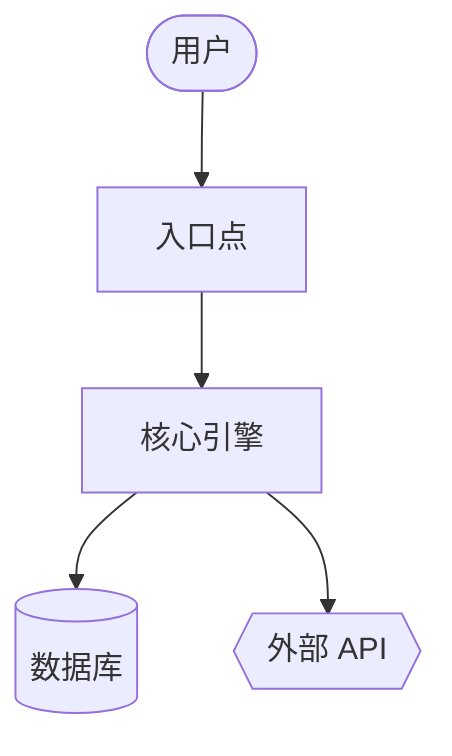
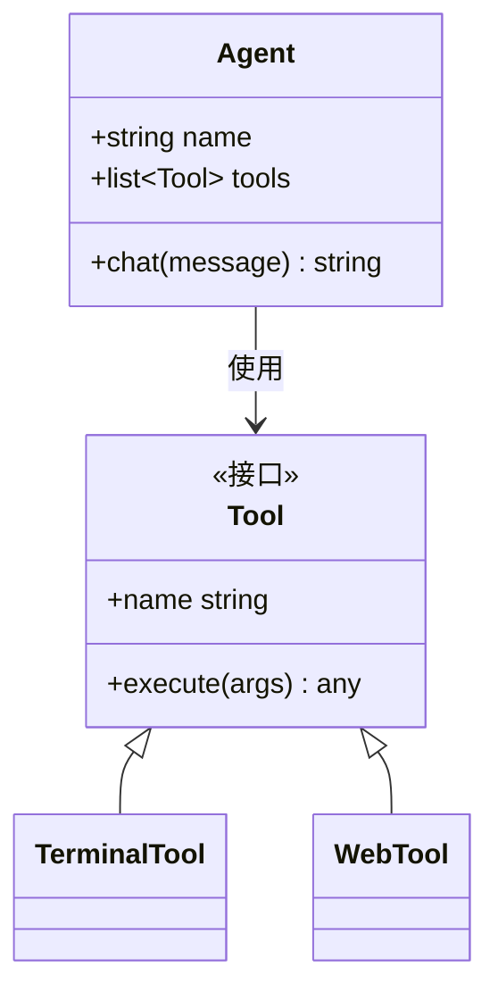
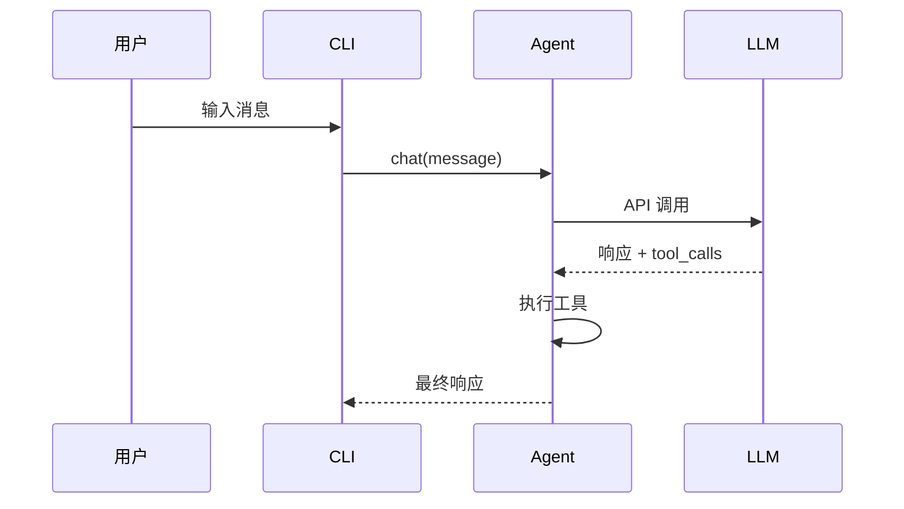

title: "Code Wiki — 为任何代码库生成 Wiki 文档 + Mermaid 图表"
sidebar_label: "Code Wiki"
description: "为任何代码库生成 Wiki 文档 + Mermaid 图表"
---

--- body ---
--- body ---
{/* 本页面由 website/scripts/generate-skill-docs.py 从技能的 SKILL.md 自动生成。请编辑源文件 SKILL.md，而非本页面。 */}

# Code Wiki

为任何代码库生成 Wiki 文档 + Mermaid 图表。

## 技能元数据

| | |
|---|---|
| 来源 | 可选 — 通过 `hermes skills install official/software-development/code-wiki` 安装 |
| 路径 | `optional-skills/software-development/code-wiki` |
| 版本 | `0.1.0` |
| 作者 | Teknium (teknium1), Hermes Agent |
| 许可证 | MIT |
| 平台 | linux, macos, windows |
| 标签 | `Documentation`, `Mermaid`, `Architecture`, `Diagrams`, `Wiki`, `Code-Analysis` |
| 相关技能 | [`codebase-inspection`](/docs/user-guide/skills/bundled/github/github-codebase-inspection), [`github-repo-management`](/docs/user-guide/skills/bundled/github/github-github-repo-management) |

## 参考：完整的 SKILL.md

:::info
以下是 Hermes 在触发此技能时加载的完整技能定义。这是技能激活时代理所看到的指令。
:::

# Code Wiki 技能

为任何代码库生成全面的 wiki — 概述、架构、每个模块的深入探究、Mermaid 类图和时序图。灵感来源于 Google CodeWiki，但适用于本地仓库、私有仓库以及任何语言。仅使用现有的 Hermes 工具（`terminal`、`read_file`、`search_files`、`write_file`）；无需 Docker、外部服务或额外依赖。

该技能生成**参考文档**（是什么/怎么做）。它不生成策略性叙述（为什么——这是另一个技能的任务）。

## 何时使用

- 用户说“记录此代码库”、“生成 wiki”、“制作架构图”
- 融入不熟悉的仓库并希望获得结构化的参考
- 用户指向 GitHub URL 并请求文档
- 需要稳定的产物（Markdown + Mermaid），可在 GitHub 上渲染

**不要**用于：
- 单个文件或单个函数的文档 — 直接回答即可
- 单个端点的 API 参考 — 使用 `read_file` 并内联回答
- 策略性的“为什么存在”叙述 — 这是另一个技能的任务，不同用途
- 用户当前在本次会话中积极开发的代码库 — 按需回答问题即可

## 前提条件

- 不需要环境变量。
- 需要 `git` 在 PATH 中，用于仓库 SHA 追踪和远程克隆。
- 可选：`pygount` 用于语言分布统计（参见 `codebase-inspection` 技能）。

## 运行方式

通过 `terminal` 工具从目标仓库的根目录调用，然后使用 `read_file` / `search_files` / `write_file` 生成 wiki。默认输出位置为 `~/.hermes/wikis/<repo-name>/`。仅在用户明确要求时写入仓库内（`docs/wiki/`）。

## 快速参考

| 步骤 | 操作 |
|---|---|
| 1 | 确定目标 — 本地 cwd、给定路径或 `git clone --depth 50 <url>` 到临时目录 |
| 2 | 扫描结构 — `ls`、`find -maxdepth 3`、清单文件、README |
| 3 | 挑选 8-10 个模块进行文档化 |
| 4 | 编写 `README.md`（概述 + 模块映射） |
| 5 | 编写 `architecture.md`（包含 Mermaid 流程图） |
| 6 | 在 `modules/` 中编写每个模块的文档 |
| 7 | 编写 `diagrams/class-diagram.md`（Mermaid classDiagram） |
| 8 | 编写 `diagrams/sequences.md`（Mermaid sequenceDiagram，2-4 个工作流） |
| 9 | 编写 `getting-started.md` |
| 10 | 编写 `api.md`（如适用，否则跳过） |
| 11 | 编写 `.codewiki-state.json` |
| 12 | 向用户报告路径 |

## 流程

### 1. 确定目标

对于 GitHub URL：

```bash
WIKI_TMP=$(mktemp -d)
git clone --depth 50 <url> "$WIKI_TMP/repo"
cd "$WIKI_TMP/repo"
REPO_SHA=$(git rev-parse HEAD)
REPO_NAME=$(basename <url> .git)
```

对于本地路径（或未指定时的 cwd）：

```bash
cd <path>
REPO_SHA=$(git rev-parse HEAD 2>/dev/null || echo "uncommitted")
REPO_NAME=$(basename "$PWD")
```

然后设置输出目录：

```bash
OUTPUT_DIR="$HOME/.hermes/wikis/$REPO_NAME"
mkdir -p "$OUTPUT_DIR/modules" "$OUTPUT_DIR/diagrams"
```

### 2. 扫描仓库结构

使用 `terminal` 工具执行 Shell 工作，使用 `read_file` 读取清单：

```bash
# 浅层树状结构
ls -la

# 深层树状结构，过滤噪音
find . -type d \
  -not -path '*/\.*' \
  -not -path '*/node_modules*' \
  -not -path '*/venv*' \
  -not -path '*/__pycache__*' \
  -not -path '*/dist*' \
  -not -path '*/build*' \
  -not -path '*/target*' \
  -maxdepth 3 | sort

# 语言分布（如果 pygount 不可用则跳过）
pygount --format=summary \
  --folders-to-skip=".git,node_modules,venv,.venv,__pycache__,.cache,dist,build,target" \
  . 2>/dev/null || true
```

然后 `read_file` 相关的清单文件（`package.json`、`pyproject.toml`、`setup.py`、`Cargo.toml`、`go.mod`、`pom.xml`、`build.gradle`）以及项目 README。使用 `search_files target='files'` 找到它们，而不是猜测文件名。

### 3. 挑选要文档化的模块

初始遍历限制为 **8-10 个模块**。按语言启发式选择：

- Python：顶级包（包含 `__init__.py` 的目录），以及子系统目录
- JS/TS：`src/<subdir>`，顶级工作区目录
- Rust：工作区中的每个 crate，或顶级 `src/<module>` 目录
- Go：每个顶级包目录
- 混合/不熟悉：包含源代码的顶级目录（非配置、非测试）

对于非常大的仓库，按以下优先级排序：
1. 被导入的次数（被大量导入的模块是核心）
2. 代码行数（较大的模块通常应有自己的文档）
3. 在 README / 顶级文档中被提及的次数

在大型仓库上生成每个模块的文档之前，向用户说明模块列表——给他们机会重新定向。

### 4. 编写 `README.md`

`read_file` 实际的项目 README 以及顶部 2-3 个入口点文件。然后 `write_file`：

````markdown
# <项目名称>

<一个段落：它是什么以及它的用途。独立成文——不要假设读者已有源代码 README。>

## 核心概念

- **<概念 1>** — <一行说明>
- **<概念 2>** — <一行说明>

## 入口点

- [`path/to/main.py`](https://github.com/NousResearch/hermes-agent/blob/main/optional-skills/software-development/code-wiki/<link>) — <启动时运行的内容>
- [`path/to/cli.py`](https://github.com/NousResearch/hermes-agent/blob/main/optional-skills/software-development/code-wiki/<link>) — <CLI 接口>

## 高级架构

<2-3 句话。详情见 architecture.md。>

参见 [architecture.md](https://github.com/NousResearch/hermes-agent/blob/main/optional-skills/software-development/code-wiki/architecture.md)。

## 模块映射

| 模块 | 用途 |
|---|---|
| [`<module>`](https://github.com/NousResearch/hermes-agent/blob/main/optional-skills/software-development/code-wiki/modules/<module>.md) | <一行用途说明> |

## 入门指南

参见 [getting-started.md](https://github.com/NousResearch/hermes-agent/blob/main/optional-skills/software-development/code-wiki/getting-started.md)。
````

在本地模式下，链接目标使用相对路径。对于克隆的仓库，使用 `https://github.com/<owner>/<repo>/blob/<sha>/<path>` 以便链接在未来的提交中保持有效。

### 5. 编写 `architecture.md`

````markdown
# 架构

<2-3 个段落：系统的形态。哪些部分与哪些部分通信。数据从何进入、从何退出、状态存在于何处。>

## 组件

- **<组件>** — <1-2 句话>。参见 [`modules/<module>.md`](https://github.com/NousResearch/hermes-agent/blob/main/optional-skills/software-development/code-wiki/modules/<module>.md)。

## 系统图



## 数据流

1. **<步骤>** — [`<file>`](https://github.com/NousResearch/hermes-agent/blob/main/optional-skills/software-development/code-wiki/<link>)
2. **<步骤>** — [`<file>`](https://github.com/NousResearch/hermes-agent/blob/main/optional-skills/software-development/code-wiki/<link>)

## 关键设计决策

- <读者需要了解的任何重要事项>
````

**Mermaid 形状语义：**
- `[]` = 组件
- `[()]` = 数据库/存储
- `{{}}` = 外部服务
- `(())` = 入口点或终端
- `-->` = 同步调用，`-.->` = 异步/事件

每个图限制在约 20 个节点以内。如果更大，拆分为子图。

### 6. 在 `modules/` 中编写每个模块的文档

对于每个选定的模块，使用 `ls` 检查其布局，识别 3-5 个最重要的文件（按大小、名为 `core.py` / `main.py` / `__init__.py`、被大量导入等），然后 `read_file` 这些文件（使用 `offset` / `limit` 只读取所需部分；对于特定符号，优先使用 `search_files`）。

````markdown
# 模块: `<module>`

<1-2 句话的用途说明。>

## 职责

- <列表项>
- <列表项>

## 关键文件

- [`<module>/<file>`](https://github.com/NousResearch/hermes-agent/blob/main/optional-skills/software-development/code-wiki/<link>) — <它的作用>

## 公共 API

<其他代码使用的函数/类/常量。将相关项分组。显示签名，而非完整实现。>

## 内部结构

<模块内部如何组织。状态管理。>

## 依赖关系

- **被使用于：** <其他模块>
- **使用：** <其他模块 + 外部库>

## 值得注意的模式 / 陷阱

- <任何不显而易见的东西>
````

### 7. 编写 `diagrams/class-diagram.md`

挑选 5-10 个最重要的类/类型。`read_file` 它们，然后编写：

````markdown
# 类图

## 核心类型



## 备注

<图无法表达的任何内容——生命周期、线程等。>
````

对于没有类的语言（Go、C、Rust）：使用该图表示结构体关系，或跳过 class-diagram.md 并在 architecture.md 中用散文解释。不要强行套用。

### 8. 编写 `diagrams/sequences.md`

挑选 2-4 个最重要的工作流。追踪代码中的每个调用路径（读取入口点，跟踪函数调用），然后：

````markdown
# 时序图

## 工作流: <名称>

<1 句话描述此工作流的作用及何时运行。>



### 逐步解析

1. **用户输入** — [`cli.py:HermesCLI.run_session`](https://github.com/NousResearch/hermes-agent/blob/main/optional-skills/software-development/code-wiki/<link>)
2. **消息分发** — [`run_agent.py:AIAgent.chat`](https://github.com/NousResearch/hermes-agent/blob/main/optional-skills/software-development/code-wiki/<link>)
````

不要虚构参与者。每个方框必须对应一个读者可以在代码中找到的真实组件。

### 9. 编写 `getting-started.md`

````markdown
# 入门指南

## 前提条件

<从清单文件和 README 中获取。具体说明——如果有固定版本，则注明。>

## 安装

```bash
<精确命令>
```

## 首次运行

```bash
<让系统执行有用操作的最少命令>
```

## 常见工作流

### <工作流 1>
<命令>

## 配置

- `<config-file>` — <它控制的内容>
- 环境变量 `<VAR>` — <它控制的内容>

## 下一步

- 架构： [architecture.md](https://github.com/NousResearch/hermes-agent/blob/main/optional-skills/software-development/code-wiki/architecture.md)
- 模块参考： [README.md#module-map](https://github.com/NousResearch/hermes-agent/blob/main/optional-skills/software-development/code-wiki/README.md#module-map)
````

### 10. 编写 `api.md`（如不适用则跳过）

仅当项目是库或 API 服务器时编写此文件。如果是：
- 找到公共 API 接口（`__init__.py` 导出、OpenAPI 规范、路由处理程序、导出的类型）
- 记录每个公共入口，包括签名、参数、返回类型、一行描述
- 按类别分组

### 11. 编写状态文件

```bash
cat > "$OUTPUT_DIR/.codewiki-state.json" <<EOF
{
  "repo_name": "$REPO_NAME",
  "source_path": "$PWD",
  "source_sha": "$REPO_SHA",
  "generated_at": "$(date -u +%Y-%m-%dT%H:%M:%SZ)",
  "generator": "hermes-agent code-wiki skill v0.1.0",
  "modules_documented": []
}
EOF
```

### 12. 向用户报告

准确说明生成了什么以及在哪里：

```
Generated wiki at ~/.hermes/wikis/<repo-name>/:
  README.md                   project overview, module map
  architecture.md             system architecture + flowchart
  getting-started.md          setup, first run, workflows
  modules/<N files>           per-module deep-dives
  diagrams/architecture.md    Mermaid flowchart
  diagrams/class-diagram.md   Mermaid class diagram
  diagrams/sequences.md       Mermaid sequence diagrams
```

如果克隆到了临时目录，提醒用户可以在审查 wiki 后删除它（`rm -rf "$WIKI_TMP"`）。

## 范围控制

为 500K 行代码的单体仓库生成完整的 wiki 是非常消耗 token 的。默认使用有限范围：

- 初始扫描：最大深度 3 级目录
- 每个模块的文档：除非用户扩展范围，否则限制在 10 个模块以内
- 每个文件的读取：优先使用 `search_files` 查找符号，并使用带 `offset`/`limit` 的 `read_file`，而不是完整读取
- 跳过供应商代码（`vendor/`、`third_party/`、生成代码、`_pb2.py`、`.min.js`）

如果用户说“彻底做完全部”，则相信他们——但首先大致估算成本：“此仓库约有 340 个源文件，全面覆盖将非常昂贵——是否确认？”

## 重新运行 / 更新

如果目标路径已存在 `.codewiki-state.json`：

- 读取其中的先前 SHA 和模块列表
- 如果源 SHA 匹配：询问用户是否要重新生成或跳过
- 如果 SHA 不同：提供仅重新生成文件发生更改的模块（`git diff --name-only <old-sha> HEAD`）

完全的增量重新生成是未来的增强功能——目前，整体重新生成是可以接受的。

## 陷阱

- **捏造组件。** 图中的每个节点和声称的函数调用都必须在源代码中。在写入之前先 `read_file`。自动生成文档最大的失败模式是听起来合理的捏造。
- **泛泛的 AI 散文。** “此模块负责……”是空话。用领域特定的术语说明该模块实际做什么。
- **将代码转述为散文。** 模块文档中说“`process` 函数通过对每个项目调用 `process_item` 来处理项目”，这比直接链接到该函数更差。
- **Mermaid 超过 50 个节点。** 它们无法清晰渲染。请拆分。
- **将测试、生成的代码或供应商依赖当作产品代码来文档化。** 跳过它们。
- **未经询问就在仓库内输出。** 默认是 `~/.hermes/wikis/`。仅当用户明确要求时才写入仓库。
- **Mermaid 特殊字符需加引号：** 使用 `A["Tool / Agent"]` 而非 `A[Tool / Agent]`。在节点内部换行使用 `<br>`。
- **SKILL.md 中的嵌套代码栅栏。** 在编写包含 Mermaid 块的 Markdown 示例时，使用 4 反引号作为外层栅栏，这样内部的 3 反引号 ` ```mermaid ` 不会关闭外层。（本 SKILL.md 即采用此方法。）
- **classDiagram 泛型** 渲染为 `~T~`（例如 `List~Tool~`），而非 `<T>`。
- **GitHub Mermaid 主题是固定的**——不要包含 `%%{init: ...}%%` 块；它们在渲染时会被剥离。

## 验证

编写完成后，请验证：

1. **Mermaid 块平衡** —— 每个文件的开闭数量相等：
   ```bash
   for f in "$OUTPUT_DIR"/diagrams/*.md "$OUTPUT_DIR"/architecture.md; do
     opens=$(grep -c '^```mermaid' "$f")
     total=$(grep -c '^```' "$f")
     echo "$f: $opens mermaid blocks, $total total fences (expect total = opens*2)"
   done
   ```
2. **所有预期文件都存在** ——
   ```bash
   ls "$OUTPUT_DIR"/{README.md,architecture.md,getting-started.md,.codewiki-state.json} \
      "$OUTPUT_DIR"/modules/ "$OUTPUT_DIR"/diagrams/
   ```
3. **模块数量与您意图一致** —— `ls "$OUTPUT_DIR/modules" | wc -l` 应等于您在步骤 3 中承诺的模块数量。
4. **没有捏造的路径** —— 抽查 2-3 个源代码链接是否解析到真实文件。