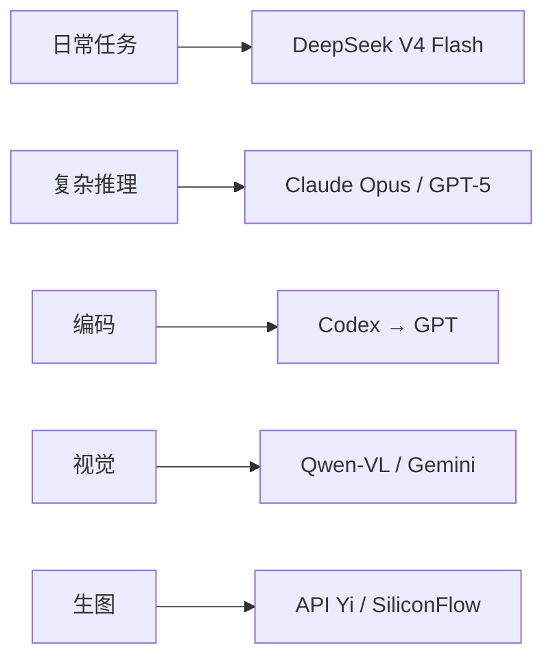

> 所有 API Key 已隐去。价格以实际为准，这里只是量级参考。

---

## 模型路由总览



### 用量分布

| 模型 | 渠道 | 用量 | 单次成本 |
|------|------|------|---------|
| DeepSeek V4 Flash | DeepSeek 官方 | ~80-90% | 极低 |
| Claude Opus | 第三方中转 | ~5% | 高 |
| GPT-5.x | 第三方中转 | ~5% | 中高 |
| Gemini Pro | 第三方中转 | ~3% | 中 |
| Qwen-VL | 第三方中转 | ~2% | 低 |

---

## 供应商

### DeepSeek 官方

- **接入**：官方 API
- **使用**：DeepSeek V4 Flash（日常主力）
- **特点**：便宜、快、中文好、大部分工具调用都够用
- **出口**：美国

### 第三方中转（API Yi）

- **接入**：`api.apiyi.com/v1` (OpenAI 兼容)
- **覆盖**：GPT-5.x、Claude Opus、Gemini Pro、chatgpt-image-latest
- **特点**：一条 Key 覆盖御三家，不用分别开账号
- **出口**：美国（走代理）

### 国内 API（SiliconFlow）

- **接入**：`api.siliconflow.cn/v1`
- **覆盖**：Qwen-Image、Z-Image-Turbo、Qwen-VL 等国内模型
- **特点**：便宜（生图 $0.005-$0.03/张）、无需海外支付
- **出口**：**直连**（不能走代理）

---

## 图像生成

| 管线 | 成本 | 质量 | 人像 | 适用 |
|------|------|------|------|------|
| API Yi chatgpt-image-latest | ~$1/张 | ⭐⭐⭐⭐⭐ | ✅ | 角色图、高质量 |
| SiliconFlow Qwen-Image | ~$0.03/张 | ⭐⭐⭐ | ❌ 脸崩 | 风景/概念图 |
| SiliconFlow Z-Image-Turbo | ~$0.005/张 | ⭐⭐⭐⭐ | ✅ 男性写实 | 写实人像 |

> **注意**：SiliconFlow 是**国内 API**，调用前必须去掉代理环境变量。API Yi 是**海外中转**，必须走代理。

---

## 语音

| 服务 | 用途 | 成本 |
|------|------|------|
| edge-tts（本地） | 中文语音合成 | 免费 |
| faster-whisper（本地 GPU） | 语音转文字 | 免费 |
| MiniMax TTS（Token 计费） | 高质量合成 | 按量 |

---

## 代理路由规则

```yaml
# 走代理（美国出口）：
openai.com
anthropic.com
deepseek.com
apiyi.com

# 直连（不走代理）：
siliconflow.cn
weixin.qq.com
ilinkai.weixin.qq.com
```

---

## 环境变量清单

| 变量 | 用途 | 敏感 |
|------|------|------|
| `DEEPSEEK_API_KEY` | DeepSeek 官方 API | ✅ |
| `APIYI_API_KEY` | 第三方中转 | ✅ |
| `SILICONFLOW_API_KEY` | SiliconFlow（国内生图） | ✅ |
| `WEIXIN_TOKEN` | 微信 iLink Bot | ✅ |
| `WEIXIN_ACCOUNT_ID` | 微信 Bot ID | ✅ |
| `CLOUDFLARE_API_TOKEN` | Cloudflare Pages 部署 | ✅ |
| `TZ` | 时区 | ❌ |
